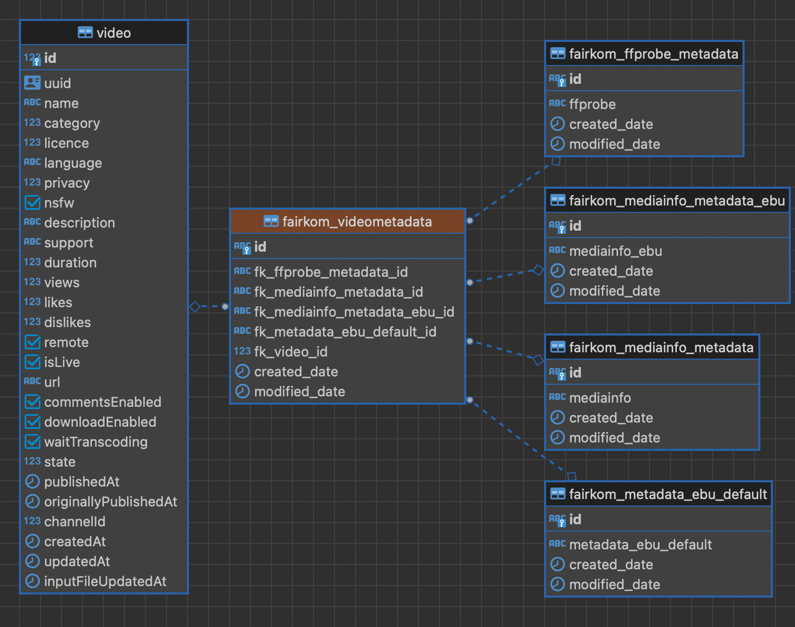

# Metadata PeerTube plugin

This plugin enhances the PeerTube platform by enabling the addition of EBU metadata to videos. It utilizes tools such as Mediainfo, MediainfoEBU, and FFProbe to extract detailed information about each video. This metadata can be input during the video upload process and will subsequently be displayed below the video. Additionally, there's flexibility to specify which data should be visible on the video editing page and which should be displayed on the frontend. Furthermore, the plugin also syncs standard PeerTube video data.

### EBU Metadata list added

Includes various fields from the EBU metadata set. Here is a [link to all the saved data](https://example.com/link-to-data) which is used.

## Requirements

- PeerTube Version: Compatible with PeerTube versions 3.4.0 or higher.
- Mediainfo: Must be installed on the server.

## How to install

1. Log in as an administrator to your PeerTube instance.
2. Navigate to the 'Plugins/Themes' section located within the Administration area.
3. Search for 'metadata' in the list of available plugins.
4. Click on 'Install' to add the plugin to your PeerTube instance.

## Setup

- When the form settings are changed, the page must be reloaded.
- Certain standard PeerTube data are synchronized into the metadata. These include:

The synchronized standard video data should not be displayed in the backend to prevent confusion. This is because they are updated only when the 'Update' button is clicked. Details on which PeerTube standard data should not be displayed can be found in the following section (Sync Information).

## Sync Information

| Peertube Standard data    | :fast_forward: | Plugin metadata mappingname |
| :------------------------ | :------------: | --------------------------: |
| videoEditData.name        | :fast_forward: |                 title.title |
| videoEditData.description | :fast_forward: |           description .text |
| videoEditData.tags        | :fast_forward: |            description.tags |
| videoEditData.language    | :fast_forward: |   videoInformation.language |
| videoEditData.category    | :fast_forward: |   videoInformation.category |
| videoEditData.licence     | :fast_forward: |    rights.copyright.rightId |

EBU Defaults can be found in model/Defaults

```
- Formfield Object...
  {
  [
  "name": 'mappingname',
  "label": 'labelname',
  "required": true,
  "visibleBackend": true,
  "visibleFrontend": true
  ],
  }
```

## Hooks:

Upload hook: When uploading a video, the plugin uses tools such as Mediainfo, MediainfoEBU and FFProbe to collect detailed information about the video, including the video and audio streams, formats and encodings. However, this data is not initially displayed, as the analysis only begins during the upload process and the website is already loaded at this point.

Update hook: On the main video editing page, there is an option to use these analysis tools again. By clicking on 'Refresh', the metadata in the database is updated. This updated information will then be visible on a subsequent visit to the page.


## Entity-Relationship-Diagramm


Entity-Relationship-Diagramm wurde so konzepiert, damit es einfach in einzelne Fields ausgelagert könnte

## TODO

//TODO: set standardVideoData required not poosible at the moment because hook is missing: https://docs.joinpeertube.org/api/plugins#server-hooks-only-plugins (it is planned https://github.com/Chocobozzz/PeerTube/issues/5704)

// TODO: List
// Sync the different data from the tools
// TODO: Streams has multiple segments. What specific elements need to be included?
// values in 'EbuDefaults.js' to store the data in and the formdefintion in 'settings.js'
// Presently, I straightforward approach by storing all stream data in one input-textarea: (mediainfo.audioStreams, mediainfo.textStreams, mediainfo.menuStreams)
// The question now is which details stream values are important, should be changeable and synced

//TODO: Save everything to the DB and nothing more in the plugin data

//TODO: Version

//TODO: Sidecardfile download: kannst du mir die Vorlage geben bitte

//TODO: Seite ladet zu lange bei Creator modus

//TODO: - Licence vorlage Category: https://gitlab.mim-libre.fr/extensions-peertube/categories-management-plugin/

- Required: + Error Message:

### Development

- Follow the local environment setup tutorial: [Local Environment Tutorial](https://github.com/Chocobozzz/PeerTube/blob/develop/.github/CONTRIBUTING.md#prerequisites).

- Documentation: Consult the [PeerTube Plugin Documentation](https://docs.joinpeertube.org/contribute/plugins) for more information.

- Build the CLI: Execute the following command to set up the Command Line Interface:
  `npm run setup:cli`

- Start the development instance: Use this command to initiate the development environment:
  `NODE_ENV=dev npm start`

- Install or reinstall your local plugin/theme: Run one of the following commands to install or reinstall your local plugin/theme:
  `peertube-cli plugins install --path <path-to-plugin>`
  or
  `node ./dist/server/tools/peertube.js plugins install --path <path-to-plugin>`

// TODO: delete in the end this code
peertube-cli plugins install --path /Users/monz/Git/FS1/peertube-plugin-metadata
export NODE_OPTIONS=--openssl-legacy-provider

Helpful:
/_
console.log("peertubeHelpers", peertubeHelpers);
console.log(
"peertubeHelpers.config.getServerListeningConfig",
peertubeHelpers.config.getServerListeningConfig()
);
console.log(
"plugin.getBaseStaticRoute",
peertubeHelpers.plugin.getBaseStaticRoute()
);
console.log(
"plugin.getBaseRouterRoute",
peertubeHelpers.plugin.getBaseRouterRoute()
);
console.log(
"plugin.getBaseWebSocketRoute",
peertubeHelpers.plugin.getBaseWebSocketRoute()
);
console.log(
"plugin.getDataDirectoryPath",
peertubeHelpers.plugin.getDataDirectoryPath()
);
_/
