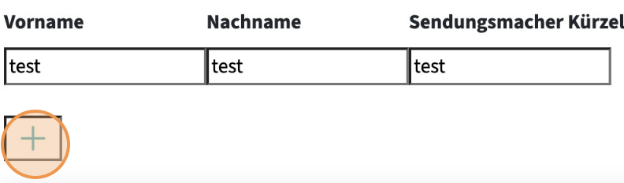

# Metadata PeerTube Plugin

This plugin enhances the PeerTube platform by enabling the addition of metadata to videos. It utilizes tools such as Mediainfo to extract detailed information about each video. This metadata can be input during the video upload process and will subsequently be displayed below the video. Additionally, there's flexibility to specify which data should be visible on the video editing page and which should be displayed on the frontend. Furthermore, the plugin also syncs standard PeerTube video data

## Installation

1. Log in as an administrator to your PeerTube instance.
2. Navigate to the 'Plugins/Themes' section located within the Administration area.
3. Search for 'metadata' in the list of available plugins.
4. Click on 'Install' to add the plugin to your PeerTube instance.

## Requirements

- Mediainfo: Must be installed on the server.

Works with other plugins:

- extra-licenses: A plugin that extends the PeerTube licenses with some non-standard ones
- categories: Manage video categories.

# User Documentation

This documentation serves as a guide on how to use the features and functionalities of the plugin. It covers various aspects such as settings customization, entity management, and more.

## Video Editing

1. Navigate to a video and click on the three dots.

2. Click on "Edit Video".

3. Change the tab to the Plugin Settings.

4. Edit the additional video metadata you want.

## Settings

1. On the left sidebar click "Settings"

2. In the "Metadata View Design" field, you have the option to customize fields in the video editing area. Click on the "Metadata View Design" field to edit it.

3. In the "Metadata View Design" field, you have the ability to customize your layout using a diverse range of objects. This allows you to define headers and input fields.
   There are 3 types of objects and each has different properties available:

   - header,
   - input,
   - entity

⚠️ **Info:** adding entities has probably no effect

- Example Object:
  {
  [ "name": 'mappingname', "label": 'labelname', "required": true, "visibleBackend": true, "visibleFrontend": true ],
  }

- Below, you'll find a comprehensive list of all the possible objects, along with their individual functionalities.

| **Property**      | **properties in possible objects**              | **Purpose**                                                                                                           |
| ----------------- | ----------------------------------------------- | --------------------------------------------------------------------------------------------------------------------- |
| type              | [x] header, [x] input, [x] checkbox, [x] entity | Identifies the type of the object. For example header, input, entity                                                  |
| label             | [x] header, [x] input, [x] checkbox, [x] entity | Provides a precise label or title visible to the end user                                                             |
| size              | [x] header, [ ] input, [ ] checkbox, [ ] entity | Specifies the size of the header, ranging from 1 (smallest) to 6 (largest)                                            |
| caption           | [ ] header, [x] input, [x] checkbox, [x] entity | Provides additional explanatory text for the object                                                                   |
| required          | [x] header, [x] input, [x] checkbox, [x] entity | Indicates if the input is required during video editing                                                               |
| visibleVideoEdit  | [x] header, [x] input, [x] checkbox, [x] entity | Indicates if the object is visible during video editing                                                               |
| visibleVideoWatch | [x] header, [x] input, [x] checkbox, [x] entity | Indicates if the object is visible during video playback                                                              |
| mappingname       | [ ] header, [x] input, [x] checkbox, [x] entity | Internal identifier for association purposes, don't change! Changing this may disrupt associations and data integrity |

⚠️ **Warning:** Modifying `mappingname` should be approached with caution. These actions may disrupt internal processes and compromise data integrity.

- When the form settings are changed, the page must be reloaded.
- Certain standard PeerTube data are synchronized into the metadata. These include:

The synchronized standard video data should not be displayed in the backend to prevent confusion. This is because they are updated only when the 'Update' button is clicked. Details on which PeerTube standard data should not be displayed can be found in the following table:

| Peertube Standard data    | :fast_forward: | Plugin metadata mappingname |
| :------------------------ | :------------: | --------------------------: |
| videoEditData.name        | :fast_forward: |                 title.title |
| videoEditData.description | :fast_forward: |           description .text |
| videoEditData.tags        | :fast_forward: |            description.tags |
| videoEditData.language    | :fast_forward: |   videoInformation.language |
| videoEditData.category    | :fast_forward: |   videoInformation.category |
| videoEditData.licence     | :fast_forward: |    rights.copyright.rightId |

4.  Click on "Update plugin settings" if you want to save the new view. Note: It's recommended to validate the format's authenticity before saving to avoid errors. Here you can validate your input
    (https://jsonlint.com/)

## Entities

There are two entities, which can also be accessed via the side menu: creator and organizations.

### Creator

1. On the left sidebar click "Creator"

2. To add a Creator, provide their first name, last name, abbreviation, and role. Click the + icon to proceed.

3. Below, there is a table displaying the entities already created, in addition to the previously mentioned values, the table also includes an ID, which serves internal purposes.

4. These entities can be edited or deleted. At the end of each row in the table.

### Organizations

1. On the left sidebar click "Organizations"

2. To add an Organization, provide a name and an abbreviation. Click the + icon to proceed.

3. Below, there is a table displaying the entities already created, in addition to the previously mentioned values, the table also includes an ID, which serves internal purposes.

4. These entities can be edited or deleted. At the end of each row in the table.

# Development Documentation

This documentation aims to provide developers with a comprehensive understanding of the plugin's architecture, components, and customization options.

# Dependencies:

- Mediainfo: Must be installed on the server.

## Development

In this section, developers will find useful insights, tips, and tricks for effectively developing with the software.

### Development Setup

- Follow the local environment setup tutorial: [Local Environment Tutorial](https://github.com/Chocobozzz/PeerTube/blob/develop/.github/CONTRIBUTING.md#prerequisites).

- Documentation: Consult the [PeerTube Plugin Documentation](https://docs.joinpeertube.org/contribute/plugins) for more information.

- Build the CLI: Execute the following command to set up the Command Line Interface:
  `npm run setup:cli`

- Start the development instance. Clone the PeerTube Repository. Use this command to start the development environment:
  `NODE_ENV=dev npm start`

- Build the project:
  `npm run build`

- Install or reinstall the local plugin: Run one of the following commands to install or reinstall the local plugin:
  `peertube-cli plugins install --path <path-to-plugin>`
  or
  `node ./dist/server/tools/peertube.js plugins install --path <path-to-plugin>`

- If build process throws an error maybe this helps:
  `export NODE_OPTIONS=--openssl-legacy-provider`

### Deployment

- To publish the plugin, navigate to the plugin directory and execute npm publish. Whenever you need to release a new version, simply update the version key in the package.json file and publish it again on NPM. Keep in mind that it may take around 24 hours for the PeerTube index to recognize your updated version.

More infos: https://docs.joinpeertube.org/contribute/plugins#publish

- If you don't want to wait 24 hours, there's a workaround. You can manually set the latest version in the database to match the currently published version. This allows you to update the plugin earlier on the frontend of your production instance.

## Overall Process

When a video is uploaded, the plugin utilizes the MediaInfo tool to gather comprehensive details about the video, such as its video and audio streams, formats, and encodings. This information is then saved to the database. Upon updating the video with user-input metadata, the plugin merges this metadata with the previously collected MediaInfo metadata and once again saves it to the database. Additionally, users can download a sidecar file containing the merged metadata.

## Entity-Relationship-Diagramm

Metadata:

Creator:

Organization:

## Architecture

This section provides an overview of the software's architecture, including its underlying structure, components, and interactions.

### Controller

Developers can find information about controllers in this section. Controllers play a crucial role in handling incoming requests, processing them, and sending back appropriate responses. They serve as the bridge between the client-side interface and the server-side logic.

To access controller information, developers can make requests using the following endpoint format:

`curl -X GET {domain}/plugins/metadata/{pluginversion}/router/{endpoint}`

List of Controllers:

1.  Category Controller:
    Function: Handles operations related to categories, specifically retrieving available categories.
    Endpoint: GET "/category/"
    Path: "./server/controller/category.js"
    Task: Provides an endpoint to fetch all available categories from the server. This allows users to access and utilize category information within the PeerTube client.

2.  Language Controller:
    Path: "./server/controller/language.js"
    Function: Manages language-related operations, specifically retrieving available languages.

    Task: Provides an endpoint to fetch all available languages from the server. This facilitates language selection and localization for videos within the PeerTube client.
    Endpoint: GET "/language/"

3.  Licence Controller
    Path: "./server/controller/licence.js"
    Function: Deals with licensing information for videos.
    Task: Handles licensing options and agreements for videos, enabling users to specify the terms under which their content is shared and used.
    Endpoint: GET "/licence/"

4.  Creator Controller
    Path: "./server/controller/creator.js"
    Function: Manages creator profiles and information.
    Task: Facilitates the creation and management of user profiles, allowing content creators to showcase their work and interact with the community.

    Endpoints:

    - GET "/creator/": Retrieves all creators.
    - GET "/creator/:id": Retrieves a specific creator by ID.
    - POST "/creator/": Creates a new creator profile.
    - PUT "/creator/:id": Updates an existing creator profile.
    - DELETE "/creator/:id": Deletes a creator profile by ID.

5.  Organization Controller
    Path: "./server/controller/organization.js"
    Function: Handles operations related to organizations or groups.
    Task: Provides functionality to create, manage, and administer organizations or groups, allowing multiple users to collaborate and share resources.

    Endpoints:

    - GET "/organization/": Retrieves all organizations.
    - GET "/organization/:id": Retrieves a specific organization by ID.
    - POST "/organization/": Creates a new organization.
    - PUT "/organization/:id": Updates an existing organization.
    - DELETE "/organization/:id": Deletes an organization by ID.

6.  Sidecarfile Controller
    Function: Deals with sidecar files associated with videos.
    Path: "./server/controller/sidecarfile.js"
    Task: Handles operations related to sidecar, and gives the user a formated json sidecarfile.
    Endpoint: GET "/sidecarfile/:id": Retrieves the sidecar file associated with a specific video by its ID.

7.  Metadata Controller
    Function: Manages metadata for videos.
    Path: "./server/controller/metadata.js"
    Task: Handles the retrieval of metadata associated with videos, allowing users to access additional information about their content.
    Endpoint: GET "/metadata/:id": Retrieves metadata for a specific video by its ID.
    Info: This controller primarily focuses on retrieving metadata for videos, providing users with detailed information about the content displayed on the website frontend.

### Data Access Objects (DAO)

This section discusses Data Access Objects (DAOs) used within the plugin. DAOs serve as an intermediary between the application's business logic and the database, facilitating data interaction and manipulation.

- CreatorDAO
  Function: Manages creator profiles and information.
  Path: "./server/dao/creator.js"
  Task: Handles CRUD operations for creator profiles, allowing the creation, retrieval, modification, and deletion of user profiles within the system.

  Methods:

  - addCreator(creatorData): Adds a new creator profile to the database.
  - getAllCreators(): Retrieves all existing creator profiles from the database.
  - findCreator(creatorId): Retrieves a specific creator profile by ID.
  - modifyCreator(creatorId, updatedData): Modifies an existing creator profile with updated data.
  - deleteCreator(creatorId): Deletes a creator profile from the database by ID.

- OrganizationDAO
  Function: Manages organization profiles and information.
  Path: "./server/dao/organization.js"
  Task: Handles CRUD operations for organization profiles, allowing the creation, retrieval, modification, and deletion of organization information within the system.

  Methods:

  - addOrganization(organizationData): Adds a new organization profile to the database.
  - getAllOrganizations(): Retrieves all existing organization profiles from the database.
  - findOrganization(organizationId): Retrieves a specific organization profile by ID.
  - modifyOrganization(organizationId, updatedData): Modifies an existing organization profile with updated data.
  - deleteOrganization(organizationId): Deletes an organization profile from the database by ID.

- MetadataDAO
  Function: Manages metadata storage and retrieval for videos.
  Path: "./server/dao/metadata.js"
  Task: Handles CRUD operations for metadata associated with videos, allowing the addition, retrieval, and modification of metadata information within the system.

  Methods:

  - addMetadata(metadata, fkVideoId): Adds metadata for a specific video to the database.
  - getAllMetadata(): Retrieves all existing metadata entries from the database.
  - findMetadata(fkVideoId): Retrieves metadata for a specific video by its foreign key ID.

- SyncedMetadataDAO

  Function: Manages synchronized metadata for videos.
  Path: "./server/dao/syncedmetadata.js"
  Task: Handles CRUD operations for synchronized metadata associated with videos, enabling the addition, retrieval, and modification of metadata information synchronized with external sources.

  Methods:

  - addSyncedMetadata(metadataData, fkVideoId): Adds synchronized metadata for a specific video to the database.
  - getAllSyncedMetadata(): Retrieves all existing synchronized metadata entries from the database.
  - findSyncedMetadata(fkVideoId, uuid): Retrieves synchronized metadata for a specific video by its foreign key ID or UUID.

### Hooks

This section explains the usage and implementation of hooks within the plugin. It covers how hooks are utilized for extending functionality and integrating custom features into PeerTube.

#### Server Hooks

- action:api.video.uploaded

Function: Triggered after a video has been successfully uploaded.
Path: "./server/hooks/videoUploadHooks.js"
Task: handles the processing and storage of metadata via mediainfo for videos that are uploaded to the system.
Detail:

1. It extracts the videoId from the uploaded video data.
2. It retrieves the path of the uploaded video file using the getPath function.
3. It checks if metadata for the video already exists in the database.
4. If no metadata is found, it retrieves metadata for the video file using the getMetadata function.
5. It organizes the metadata into a structured JSON format.
6. It flattens the structured JSON using the flatten function.
7. Adds it to the database as metadata for the uploaded video.

- action:api.video.updated

Function: Triggered when a video is updated.
Path: "./server/hooks/videoUpdateHooks.js"
Task: handles the process after a video has been updated, such as updating metadata or performing specific operations based on changes made to the video.
Detail:

1. It extracts the video ID from the updated video data.
2. It checks if plugin data is available in the update body. If not, it exits the function.
3. It retrieves the plugin data from the update body.
4. It merges standard video data with plugin video data, ensuring that metadata cannot be changed.
5. It retrieves existing mediainfo metadata for the video from the database.
6. It parses the retrieved mediainfometadata into JSON format.
7. It merges the parsed mediainfo metadata with the merged standard and plugin video data.
8. It adds the updated metadata which is defined by the user to the synced metadata database table.

- filter:api.video.get.result

Function: Used to filter the result of the API request "api.video.get".
Path: "./server/hooks/videoResultHooks.js"
Task: Allows for customization of the returned video data before it is sent to the client, such as adding additional metadata or filtering specific information.
Detail:

1. It listens for the "filter:api.video.get.result" hook trigger.
2. It checks if the video object exists. If not, it returns the video object.
3. It ensures that the video object has a pluginData property, initializing it if not present.
4. It retrieves the video ID from the video data.
5. It queries the synced metadata database to find metadata associated with the video ID.
6. It checks if synced metadata exists. If not, it returns the video object.
7. It parses the retrieved metadata and assigns it to the pluginData property of the video object.
8. It returns the updated video object with synced metadata.

#### Client Hooks

- filter:left-menu.links.create.result

Function: Used to modify the list of links displayed in the left menu.
Path: "./client/router-client-plugin.js"
Task: Allows for dynamic addition of links to the left menu based on certain conditions, such as user authentication status or user role.
Detail:

1. It listens for the "filter:left-menu.links.create.result" hook trigger.
2. It checks if the user is logged in using peertubeHelpers.isLoggedIn().
3. If the user is logged in, it adds a new section titled "Metadata Plugin" to the left menu.
4. Within the "Metadata Plugin" section, it adds links to various metadata-related pages, such as creators, organizations, and settings.
5. It returns the updated list of links to be displayed in the left menu.

- action:video-watch.player.loaded

Function: This function is activated upon the full loading of the video player on the watch page.
File Path: "./client/video-watch-client-plugin.js"
Objective: The objective linked with this function includes retrieving supplementary data, processing and arranging it, and subsequently showcasing it below the video player.
Details:

1. It listens for the "action:video-watch.player.loaded" hook trigger.
2. It retrieves data from the server.
3. It processes the data to fulfill particular specifications.
4. It generates a tabular view to exhibit the data.
5. Additionally, it generates a supplementary download button adjacent to the video player.

### Client Pages

This section lists and describes the client pages utilized within the plugin. It provides an overview of the user interface components and functionalities available to the end-user.

- creator-client-page: Renders creator entities.
- organization-client-plugin: Renders organization entities.
- router-client-plugin: Utilizes the "filter:left-menu.links.create.result" hook to add items to the left menu.
- video-edit-client-plugin: Registers video edit fields through a callback function, which is then utilized within the setting view designer.
- video-watch-client-plugin: Displays data generated in the setting view designer beneath the video.

### Helper Functions

It covers the purpose, implementation, and usage of helper functions for common tasks and operations within the application.

1. **Merge Helper**: The MergeHelper provides methods for merging standard video data and metadata with plugin-specific video data.

mergeStandardVideoData(standardVideoData, pluginVideoData): Merges standard video data with plugin-specific video data.

Parameters:
standardVideoData (object): The standard video data to merge.
pluginVideoData (object): The plugin-specific video data to merge into.

Returns:
Returns the merged pluginVideoData object with synced standard video data.

Errors:
Throws an error if standardVideoData or pluginVideoData is missing.

mergeMetadata(metadata, pluginVideoData): Merges metadata with plugin-specific video data.

Parameters:
metadata (object): The metadata to merge.
pluginVideoData (object): The plugin-specific video data to merge into.

Returns:
Returns the merged pluginVideoData object with synced metadata.

Errors:
Throws an error if metadata or pluginVideoData is missing.

2. **Flatten**: The flatten function is used to flatten a object into a single-level object, where each key represents a unique path to a nested value.

Parameters:
data (Object|Array): The JSON or JavaScript object to be flattened.
path (null|Array|String): Optional. Path prefix to be added to each flattened key. Default is null.

Returns:
Returns a flattened object where nested keys are concatenated with dots (.).

3.  **Tool: trp_mediainfo getMetadata**: The getMetadata function retrieves metadata information of a given file path using the mediainfo tool and parses the output into a structured object.

Parameters:
filePath (String): The path of the file for which metadata is to be retrieved.

Returns:
Promise: A Promise that resolves with an object containing metadata information or rejects with an error message.

### Privacy

1. Relevant personal data is primarily found only on the entity pages.

- Restriction of Access through the Side Menu
- Restriction of Access to Entity Pages

The entity pages, including those for creators and organizations, are accessible only to logged-in users. This is done to maintain the confidentiality of the information provided on these pages and to ensure that only authorized users can access them.
